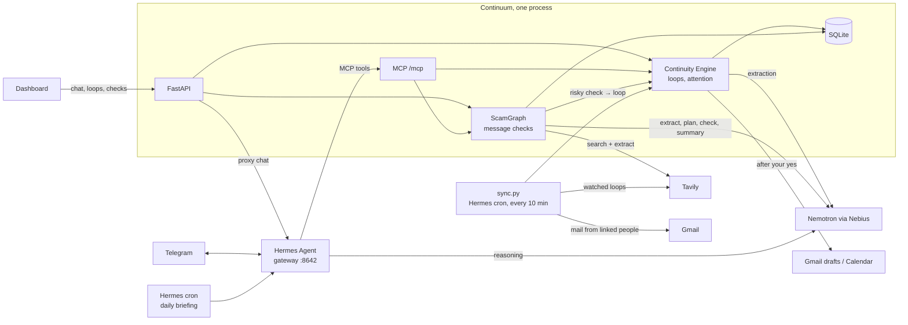

# Continuum

**A personal AI that remembers what's unfinished, and checks who's asking before you pay.**

You mention things in passing: "Sarah said she'll get back to me Friday", "I need to finish my portfolio". Then they slip. Notes apps keep what you wrote. Chatbots forget it by the next session. Continuum pulls the **open loops** out of normal conversation (tasks, your promises, things you're waiting on, deadlines), links them to your goals, keeps them until they're done, and tells you before they slip.

Some messages ask you to act and aren't from who they claim: a "bank" asking you to verify your account, a fund promising 12% a month. To Continuum, a request for your money or details is one more open loop. Before you close it, Continuum checks who's asking.

Built for the Nebius x NVIDIA Global AI Hackathon, **Personal AI** track. It runs on **NVIDIA Nemotron** through **Nebius Token Factory**, with **Hermes Agent** as the assistant you talk to. Everything here was built during the submission period: the first commit is 2026-09-29.

## How it works

Every loop goes through five steps:

1. **Capture.** You tell it in the dashboard chat or on Telegram, email arrives from someone you're waiting on, or you forward a message or a screenshot.
2. **Remember.** Goals, loops, people and the exact words each loop came from are saved in one SQLite file.
3. **Check.** When a loop asks you to pay or share details, ScamGraph researches who's asking on the live web and fixed rules score the risk.
4. **Remind.** **Needs attention** and the 8:00 Telegram briefing list what's overdue, due soon, stalled or risky.
5. **Close.** You say it's done, an email reply closes it, or the web watch finds the answer. Drafts and calendar events wait for your yes.

### A day with Continuum

- **8:00, Telegram:** "2 things need you: Sarah's reply is due tomorrow; your portfolio has had no update in 5 days."
- **9:12:** You tell Continuum you need to transfer RM5,000 to "T. Rowe Price" at troweprice-my-invest.com by Friday. It saves the loop and asks: "Want me to check who's asking first?"
- **9:14:** **Critical risk.** T. Rowe Price's real site is troweprice.com, not the link in the message, and Bank Negara's alert list names T. Rowe Price clones. The loop moves to the top of Needs attention: hold off paying.
- **15:40:** Sarah emails back. Her loop closes on its own, and the interview time waits as a calendar proposal until you say yes.
- **Next morning:** the briefing still lists the deposit until you mark it done.

*(The T. Rowe Price message is test sample B in [tests/scenarios/](tests/scenarios/).)*

### Personal AI track

| The track asks for | Continuum |
|---|---|
| Always on | Hermes runs the Telegram bot, the 8:00 briefing and the 10-minute email and web sync for as long as its gateway runs ([hermes/](hermes/), [scripts/sync.py](scripts/sync.py)) |
| Private, your data under your control | One SQLite file on your machine; see [Your data](#your-data) |
| Persistent memory | Goals, loops, people, the words each loop came from, history with undo, and every message check ([app/engine.py](app/engine.py), [app/db.py](app/db.py)). Hermes' own memory is off, so there's one source of truth. |
| Reusable skills | Two Hermes skills ([hermes/skills/](hermes/skills/)): `/check <message>` and `/briefing` on Telegram. The 8:00 cron job runs `briefing` too. |
| Tools you choose | 17 MCP tools any MCP client can call ([app/mcp_tools.py](app/mcp_tools.py)). Google, Tavily and Telegram are each opt-in. |
| Tasks across your daily workflows | Follow-up drafts, Gmail drafts, calendar events, web watch, loops closed by email replies, message checks. Anything that changes the outside world waits for your yes. |
| NVIDIA open model | Nemotron 3 Super on Nebius Token Factory for every reasoning step ([app/llm.py](app/llm.py)) |
| Hermes Agent | Chat, Telegram and cron, with Continuum's tools only ([hermes/config.example.yaml](hermes/config.example.yaml)) |

### Your data

- Your loops, goals and people live in one SQLite file (`data/continuum.db`) on your machine.
- Hermes' own memory is off, and it only has Continuum's tools: no terminal, files or browser.
- Continuum never sends anything for you.
- Our server never opens a suspicious link: Tavily reads it. Messages being checked are treated as untrusted text and never followed.
- Logs hold ids and counts, never message text. What does leave your machine is listed under [Privacy](#privacy).

## What it does

1. Tell it: *"I'm applying for an NVIDIA internship. Sarah said she'll get back to me next Friday. I also need to finish my portfolio."*
2. It saves the goal **Secure NVIDIA internship** with 2 loops: **Wait for Sarah's response** (due Fri) and **Finish portfolio**.
3. The dashboard groups loops under goals and shows due dates, with overdue items in red. Click a loop to see **the exact sentence it came from**.
4. Restart everything, then ask *"What am I waiting on?"* and it answers from its database.
5. Say *"Sarah got back to me!"* or click **Resolve**, and the loop closes. When the whole goal is finished, click **Mark goal done**.

### Before things slip

- **Needs attention.** The top of the dashboard lists what's overdue, due today or tomorrow, or hasn't been touched for 4 days (`STALE_DAYS`). Plain rules, no LLM, so it's instant and predictable. Ask *"What's urgent?"* in chat for the same list.
- **Snooze.** Hide a loop until Tomorrow, In 3 days, Next Monday or any date, from the dashboard or in chat (*"snooze the portfolio till Monday"*). It comes back on that day.
- **Drafts.** Click **Draft** (or ask *"draft a follow-up to Sarah"*) and Continuum writes a short message for you to copy. It never sends anything.
- **Telegram.** The same assistant on your phone: capture loops on the go, ask what's urgent. [Setup](#telegram-optional).
- **Daily briefing.** Every morning, a short Telegram message with what needs you. Reply to it to snooze, resolve or draft. [Setup](#daily-briefing-optional-needs-telegram).

### When loops close on their own

- **Email.** Give Continuum someone's address (*"Sarah's email is sarah@nvidia.com"*) and it reads new mail from them, and only them, every 10 minutes. A reply that answers your loop closes it, a new deadline becomes a task, and a meeting time becomes a calendar proposal. [Setup](#google-setup-optional).
- **Web.** Say *"keep an eye on the hackathon results"* and Continuum searches for it once a day with Tavily. Ask *"when does the Google STEP application close?"* and it looks it up, with the link. What the web says is only ever a proposal.
- **Your yes first.** Calendar events, Gmail drafts (*"draft a thank-you reply to Sarah"*) and web findings wait under **Pending actions**, or on Telegram, until you approve. Nothing is ever sent.
- **Undo.** Each loop's History shows what changed it (you, chat, email or the web), with Undo on automatic changes.

### Check before you pay (ScamGraph)

When something asks for your money or details, Continuum checks who's asking:

- Paste the message, a link or a screenshot on **Check a message** (`/investigate.html`).
- Or ask in chat or on Telegram: *"Is this legit?"* plus the message. A forwarded message asking for money is checked right away.
- When you save a loop about paying someone (*"I need to transfer RM5,000 to … by Friday"*), Continuum offers the check itself. A loop like that also gets a **Check who's asking** button.

The check runs five steps:

1. **Extract.** Nemotron pulls out who it claims to be (company, website, phone, email), what it claims ("licensed by SC", "12% monthly"), and pressure tactics, each with a quote from the message.
2. **Research.** Tavily searches the Securities Commission and Bank Negara alert lists, the company's real website, and a few searches Nemotron plans. The top 5 pages are read through Tavily Extract. Our server never opens the suspicious link itself.
3. **Check.** Nemotron reads each page against each claim. A quote it cites must really be on the page, or it's dropped.
4. **Score.** Fixed rules in code, not the model, set the verdicts, risk signals, score, level (LOW to CRITICAL, or *not enough evidence*) and confidence. Every signal links to its source or to a quote from the message.
5. **Show.** The page shows the steps live, then the risk level, cited findings, next steps, an evidence graph (click a node or line to open its evidence) and every claim with its sources.

Anything but low risk stays with you, including "not enough evidence to verify the sender". The loop you checked, or a new one, *"Verify <who> before paying"*, goes to the top of **Needs attention** and into the morning briefing until you resolve it.

*AI investigates. Evidence supports. Deterministic rules assess. Humans decide.* It reports risk signals, never "scam" or "scammer", and never contacts or reports anyone for you.

## Architecture



- **Continuum** (one Python process): FastAPI serves the dashboard, a REST API, and an MCP server at `/mcp/`. The continuity engine (`app/engine.py`) owns extraction, goal linking, dedup, the attention rules and storage.
- **Hermes Agent** (second process) is the chat brain, for the dashboard chat, Telegram and the daily briefing. It decides when to save (`remember`) and when to answer from memory (`list_open_loops`, `needs_attention`, `list_goals`, `inspect_loop`, `resolve_loop`, `snooze_loop`). Proposals wait for your yes (`list_pending_actions`, `approve_action`, `reject_action`). With a Tavily key it can look things up (`web_lookup`) and watch a loop on the web (`watch_loop`); what it finds only becomes a proposal (`propose_loop_update`). With Google connected it proposes calendar events and Gmail drafts (`propose_calendar_event`, `propose_gmail_draft`), created only after your yes. For a suspicious message it calls `investigate`, which runs ScamGraph and waits up to 100 s; if the check takes longer, it answers with the dashboard link. When `remember` saves a loop about paying someone, Hermes offers the check and passes that loop's id, so the result stays with the loop. It runs in its own `continuum` profile, so your default Hermes setup is untouched. Its built-in terminal, file, web, browser and memory tools are off on every platform. It only has Continuum's tools.

### Why Hermes

Continuum should hold a real conversation and decide for itself whether a message is something to remember, a question, or a status update. Hermes gives us that agent loop, conversation history and an OpenAI-style API server. Continuum stays the single source of truth through MCP, so there's no second memory to drift out of sync.

### Nemotron on Nebius

Both the agent and the extraction run on **NVIDIA Nemotron** (`nvidia/nemotron-3-super-120b-a12b`) through **Nebius Token Factory**:

- **Hermes** uses it for reasoning and tool calls.
- **Extraction** (`app/extraction.py`) sends Nemotron the message, the current date/timezone and your existing goals and open loops. Nemotron returns JSON (in JSON mode) with new goals, new loops, updates and resolutions. Pydantic validates it. Invalid output gets one retry with the error attached, then fails cleanly.

The engine then drops any ids the model invented, dedups by normalized title, and writes everything in **one transaction**. A failure writes nothing.

ScamGraph also uses Nemotron for every step except one: no Nemotron model on Token Factory reads images, so a screenshot goes to `google/gemma-3-27b-it` (`NEBIUS_VISION_MODEL`, same endpoint) just to turn it into text.

**Where Token Factory helped:** Hermes and our own calls share one OpenAI-compatible endpoint (`NEBIUS_BASE_URL`), and switching models is one env var (`NEBIUS_MODEL`). That let us time three Nemotron models (Nano, 3.5 Lightning, Super) on the real pipeline before picking Super, with no code change.

### Tavily

ScamGraph's research runs on **Tavily**: Search (basic depth, with `include_domains` for the regulators' sites) and Extract for the pages worth reading. A run uses at most 8 searches and 5 page reads per round, with one follow-up round. Each good reply is cached in `data/tavily_cache/`; if Tavily fails, the cached reply is used and the step says so.

## Setup

Needs **Python 3.11+**, **[Hermes Agent](https://hermes-agent.nousresearch.com)** (tested with 0.21) on your PATH, and a **Nebius API key**.

**macOS / Linux**

```bash
python -m venv .venv && .venv/bin/pip install -r requirements.txt -e .
cp .env.example .env                                # then set NEBIUS_API_KEY
.venv/bin/python scripts/setup_hermes.py            # creates the Hermes "continuum" profile
.venv/bin/uvicorn app.main:app                      # terminal 1: Continuum on :8000
hermes -p continuum gateway run                     # terminal 2: Hermes on :8642
```

**Windows (PowerShell)**

```powershell
python -m venv .venv; .venv\Scripts\pip install -r requirements.txt -e .
copy .env.example .env                              # then set NEBIUS_API_KEY
.venv\Scripts\python scripts\setup_hermes.py
.venv\Scripts\uvicorn app.main:app                  # terminal 1
hermes -p continuum gateway run                     # terminal 2
```

Open **http://127.0.0.1:8000**. Re-run `setup_hermes.py` after changing keys or the model, and after updating Continuum (it copies new tools and instructions into Hermes).

**Changing the UI** (Node 20+). The pages are React + Vite in `frontend/`. `app/static/` holds the built files, committed, so running Continuum needs no Node.

```bash
cd frontend && npm install
npm run dev      # http://localhost:5173 with hot reload; /api goes to Continuum on :8000
npm run build    # type-checks, then rebuilds app/static (commit it)
```

`TAVILY_API_KEY` in `.env` is needed for ScamGraph's research (without it, only the message itself is checked) and for web watch and lookup (free key at tavily.com). Then say "keep an eye on the hackathon results", or use **Watch the web** in a loop's detail. `python scripts/sync.py` runs the check: each watched loop is searched at most once a day, and anything found shows under **Pending actions**.

`requirements.txt` pins the tested versions; `-e .` installs Continuum itself so the scripts can import it.

On Windows the Hermes installer puts `hermes.exe` in `%LOCALAPPDATA%\hermes\bin`. If `hermes` isn't found, add that folder to your PATH.

To try the UI without an LLM, fill a scratch database with sample data: set `DATABASE_URL=sqlite:///./data/seed.db`, then run `python scripts/seed_demo.py` and start uvicorn with the same `DATABASE_URL`.

### Running on a server

Set `APP_PASSWORD` in `.env`: every page and `/api` then asks for it (any username), and `/mcp` only answers the same machine, where Hermes runs. Set `PUBLIC_URL` to the address people open, so chat links point there. Use a fresh `DATABASE_URL`, and leave Google off: its sign-in only works on your own computer.

### Telegram (optional)

Chat with Continuum from your phone. Hermes runs the bot, so there's no extra server and no public URL.

1. In Telegram, message **@BotFather**, send `/newbot`, and copy the token. Make a new bot just for Continuum: one token can't serve two running gateways.
2. Message **@userinfobot** to get your numeric user id. (Not the number at the start of the bot token: that's the bot's id.)
3. In `.env`, set `TELEGRAM_BOT_TOKEN=<token>` and `TELEGRAM_ALLOWED_USERS=<your id>`.
4. Re-run `python scripts/setup_hermes.py`, then restart `hermes -p continuum gateway run`.
5. Message your bot, e.g. *"What am I waiting on?"*

Only the user ids in `TELEGRAM_ALLOWED_USERS` get replies. On Telegram, Continuum has the same tools as the dashboard chat, nothing else. Telegram keeps one ongoing conversation; send `/new` to start fresh.

Two commands come from Continuum's Hermes skills ([hermes/skills/](hermes/skills/)), which `setup_hermes.py` installs: `/check <message>` checks who's asking, and `/briefing` sends what needs you now. Setup also removes Hermes' bundled skills from this profile; they need tools it doesn't have.

### Daily briefing (optional, needs Telegram)

Every morning at 8:00 in your `TIMEZONE`, Continuum sends what needs attention to Telegram. Reply to it to snooze, resolve or draft a follow-up. Create the job once (same command in bash and PowerShell):

```bash
hermes -p continuum cron create "0 8 * * *" "Send the morning briefing. Begin with Good morning." --skill briefing --deliver telegram --name briefing
```

An older job made from `hermes/briefing_prompt.md` switches over with `hermes -p continuum cron edit <id> --skill briefing --prompt "Send the morning briefing. Begin with Good morning."`.

The gateway (`hermes -p continuum gateway run`) must be running for it to fire. To try it now: `hermes -p continuum cron list` shows the job id, and `hermes -p continuum cron run <id>` sends it within a minute.

### Email and web sync on Telegram (optional, needs Telegram plus Google or Tavily)

Every 10 minutes Continuum reads new email from people linked to open loops, and once a day it checks each loop you asked it to watch on the web. It sends what changed to Telegram: loops an email closed or updated (undo in the dashboard), a calendar event when an email sets a date and time, and web findings. Events and web findings wait for your "yes" or "no". Create the job once, after `setup_hermes.py` (it installs the script the job runs):

```bash
hermes -p continuum cron create "every 10m" --no-agent --script continuum_sync.py --deliver telegram --name sync
```

The job runs `scripts/sync.py` without the LLM agent. Telegram only gets a message when something changed or was found, or when a check failed (the same error is sent once, not every 10 minutes). Re-run `setup_hermes.py` after moving the project.

### Google setup (optional)

Lets Continuum read email from people you're waiting on and, with your yes, save Gmail drafts and calendar events. It never sends email.

1. In [Google Cloud Console](https://console.cloud.google.com/), create a project and enable the **Gmail API** and the **Google Calendar API**.
2. Under **Google Auth Platform → Audience**, set the user type to **External**, leave the status at **Testing**, and under **Test users** add the Google account you'll sign in with. Without it, Google stops sign-in with *"Access blocked … Error 403: access_denied"* (the app is in testing and you're not a tester).
3. Under **Clients**, create a client of type **Desktop app**. Download its JSON and save it as `data/client_secret.json`.
4. In the dashboard, open **Settings** and click **Connect Google**. Your browser opens Google's sign-in.
5. Give someone's address, in chat (*"Sarah's email is sarah@nvidia.com"*) or in a loop's **Contact email**. From then on, `python scripts/sync.py` (or the cron job above) reads their new email and updates their loops. The first run reads the last 7 days (`SYNC_LOOKBACK_DAYS`).

To check the connection on its own: `python scripts/google_gate.py someone@example.com` lists the last 5 emails from that address, saves a test draft (not sent) and creates a test event tomorrow at 10:00. Delete both afterwards.

Access asked for: read Gmail, write drafts, write calendar events. The token is saved in `data/google_token.json` (gitignored). While the Google app is in testing, Google ends the connection after 7 days: connect again in Settings. **Disconnect** in Settings revokes access and deletes the token.

## Tests

```bash
pytest            # offline: LLM and Hermes are mocked
pytest -m live    # real Nemotron + Hermes + Tavily (needs keys and both servers running)
```

`pytest -m live -k scam_live` runs ScamGraph's five test scenarios (`tests/scenarios/`, all labelled test samples) with real Nemotron and Tavily, about 10 Tavily credits each: a company on Bank Negara's alert list, a clone of a real company, a real bank, a job offer with no name, and a mix of reliable and unreliable sources. Its last test asks Hermes; start Continuum on a scratch `DATABASE_URL` for that.

The live suite runs the acceptance inputs against real Nemotron, e.g. "Alex said he'll send me the dataset tomorrow" (a waiting loop due tomorrow), "The weather was nice today" (nothing saved), the same message twice (one loop), and "Alex sent the dataset" (loop resolved).

## Privacy

- Everything stays local in `data/continuum.db` (SQLite). What leaves your machine: text sent to Nebius for Nemotron to do its job; your Telegram messages if you turn Telegram on (they pass through Telegram's servers); with a Tavily key, only your watch searches and lookup questions go to Tavily, never your messages. Only the names of people you wait on go to the model, not their email addresses.
- **Email** (if you connect Google): only mail *from* people you gave an address for, and only while they have an open loop. Continuum never lists or searches the rest of your inbox. Each email's subject and new text (quotes and signature removed, at most 4,000 characters) go to Nemotron. The text is stored only if it changed a loop. Attachments are never downloaded. **Forget email data** in Settings deletes all stored email text; loops made from it stay, marked "source deleted".
- **ScamGraph**: the message, screenshot and page text go to Nebius. Names, websites, phone numbers and the submitted link go to Tavily as searches. Screenshots are saved in `data/uploads/` (gitignored, never served). A risky check's message is also kept as its loop's source. Logs hold ids, counts and step names, never the message, quotes or searches.
- Every loop links to the message it came from, and you can delete any loop.
- Continuum never sends anything on your behalf. Drafts are text for you to copy, or Gmail drafts you send yourself.
- Messages that change nothing (questions, small talk) aren't stored by Continuum. Hermes keeps its own chat history in its `continuum` profile folder.
- Logs record event names, counts and ids (`extraction_ok`, `loop_created`, `loop_resolved`, `email_synced`), never message content, email subjects or API keys.

## Limitations

- **One user.** Without `APP_PASSWORD`, run it on your own machine only.
- **ScamGraph is a heuristic.** Signal weights are plain rules, not probabilities. Finding a company's official website depends on Nemotron reading the right page, about 2 runs in 3 for a clone of a foreign company; without it the identity stays "not verified". Malaysian regulators only (SC, Bank Negara). A check takes 1-2 minutes.
- **Extraction is an LLM's judgment.** It can miss an item or misread a date. "Before Friday" may come back as Thursday or Friday. Every loop shows its source text so you can check it, and wrong loops can be deleted.
- **`next_action` is usually empty**, because the model is told never to invent anything the message doesn't state.
- **Dedup is exact-match** on normalized title + person, plus giving the model the existing loops. Reworded duplicates can slip through.
- **Hermes' standalone gateway** (`gateway.standalone: true`) is a shim Hermes marks as temporary. `hermes/config.example.yaml` describes the fallback.
- Goals are marked done from the dashboard only, not by chat.
- Chat replies take a few seconds (one Nemotron tool call plus the reply, ~3–9 s in testing).
- Telegram and the daily briefing only work while Hermes' gateway is running on your machine.
- Scheduled jobs (the daily briefing, web watch) only run while the gateway is running. A briefing missed while it was off is sent once when the gateway starts again, so it can arrive late.
- **Check who's asking** shows on loops whose words mention money, a link or an account (a keyword test). Any message can still be checked on **Check a message**.

## Feedback on Nebius Token Factory and Nemotron

- **Worked well:** one OpenAI-compatible endpoint for the agent and our own calls, and switching models by name.
- **No vision in the Nemotron family on Token Factory.** Nano 30B, 3.5 Lightning, Super 120B and Ultra 550B all return 400 "This model does not support image input". We read screenshots with Gemma 3 on the same endpoint instead.
- **Latency.** One Nemotron Super call took 11–37 s in our runs. Nano (27 s, needed a retry) and 3.5 Lightning (64 s) weren't faster for our prompts. A message check makes several calls, so it takes 1–2 minutes.
- **JSON field names drift.** Nemotron sometimes wrote `"behaviors"` where the schema says `"behaviours"`. We accept both and retry once with the validation error.

## License

[MIT](LICENSE)
