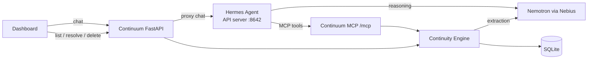

# Continuum

**A personal AI that remembers what's still unfinished.**

You mention things in passing: "Sarah said she'll get back to me Friday", "I need to finish my portfolio". Then they slip. Notes apps keep what you wrote. Chatbots forget it by the next session. Continuum pulls the **open loops** out of normal conversation (tasks, your promises, things you're waiting on, deadlines), links them to your goals, and keeps them until they're done.

Built for the Nebius x NVIDIA Global AI Hackathon, **Personal AI** track.

## What it does

1. Tell it: *"I'm applying for an NVIDIA internship. Sarah said she'll get back to me next Friday. I also need to finish my portfolio."*
2. It saves the goal **Secure NVIDIA internship** with 2 loops: **Wait for Sarah's response** (due Fri) and **Finish portfolio**.
3. The dashboard groups loops under goals and shows due dates, with overdue items in red. Click a loop to see **the exact sentence it came from**.
4. Restart everything, then ask *"What am I waiting on?"* and it answers from its database.
5. Say *"Sarah got back to me!"* or click **Resolve**, and the loop closes. When the whole goal is finished, click **Mark goal done**.

## Architecture



- **Continuum** (one Python process): FastAPI serves the dashboard, a REST API, and an MCP server at `/mcp/`. The continuity engine (`app/engine.py`) owns extraction, goal linking, dedup and storage.
- **Hermes Agent** (second process) is the chat brain. It decides when to save (`remember`) and when to answer from memory (`list_open_loops`, `list_goals`, `inspect_loop`, `resolve_loop`). It runs in its own `continuum` profile, so your default Hermes setup is untouched. Its built-in terminal, file, web, browser and memory tools are off. It only has Continuum's tools.

### Why Hermes

Continuum should hold a real conversation and decide for itself whether a message is something to remember, a question, or a status update. Hermes gives us that agent loop, conversation history and an OpenAI-style API server. Continuum stays the single source of truth through MCP, so there's no second memory to drift out of sync.

### Nemotron on Nebius

Both the agent and the extraction run on **NVIDIA Nemotron** (`nvidia/nemotron-3-super-120b-a12b`) through **Nebius Token Factory**:

- **Hermes** uses it for reasoning and tool calls.
- **Extraction** (`app/extraction.py`) sends Nemotron the message, the current date/timezone and your existing goals and open loops. Nemotron returns JSON (in JSON mode) with new goals, new loops, updates and resolutions. Pydantic validates it. Invalid output gets one retry with the error attached, then fails cleanly.

The engine then drops any ids the model invented, dedups by normalized title, and writes everything in **one transaction**. A failure writes nothing.

## Setup

Needs **Python 3.11+**, **[Hermes Agent](https://hermes-agent.nousresearch.com)** (tested with 0.21) on your PATH, and a **Nebius API key**.

**macOS / Linux**

```bash
python -m venv .venv && .venv/bin/pip install -r requirements.txt -e .
cp .env.example .env                                # then set NEBIUS_API_KEY
.venv/bin/python scripts/setup_hermes.py            # creates the Hermes "continuum" profile
.venv/bin/uvicorn app.main:app                      # terminal 1: Continuum on :8000
hermes -p continuum gateway run                     # terminal 2: Hermes on :8642
```

**Windows (PowerShell)**

```powershell
python -m venv .venv; .venv\Scripts\pip install -r requirements.txt -e .
copy .env.example .env                              # then set NEBIUS_API_KEY
.venv\Scripts\python scripts\setup_hermes.py
.venv\Scripts\uvicorn app.main:app                  # terminal 1
hermes -p continuum gateway run                     # terminal 2
```

Open **http://127.0.0.1:8000**. Re-run `setup_hermes.py` after changing the LLM provider or keys.

`requirements.txt` pins the tested versions; `-e .` installs Continuum itself so the scripts can import it.

On Windows the Hermes installer puts `hermes.exe` in `%LOCALAPPDATA%\hermes\bin`. If `hermes` isn't found, add that folder to your PATH.

To try the UI without an LLM, fill a scratch database with sample data: set `DATABASE_URL=sqlite:///./data/seed.db`, then run `python scripts/seed_demo.py` and start uvicorn with the same `DATABASE_URL`.

### Telegram (optional)

Chat with Continuum from your phone. Hermes runs the bot, so there's no extra server and no public URL.

1. In Telegram, message **@BotFather**, send `/newbot`, and copy the token. Make a new bot just for Continuum: one token can't serve two running gateways.
2. Message **@userinfobot** to get your numeric user id.
3. In `.env`, set `TELEGRAM_BOT_TOKEN=<token>` and `TELEGRAM_ALLOWED_USERS=<your id>`.
4. Re-run `python scripts/setup_hermes.py`, then restart `hermes -p continuum gateway run`.
5. Message your bot, e.g. *"What am I waiting on?"*

Only the user ids in `TELEGRAM_ALLOWED_USERS` get replies. On Telegram, Continuum has the same tools as the dashboard chat, nothing else. Telegram keeps one ongoing conversation; send `/new` to start fresh.

## Tests

```bash
pytest            # offline: LLM and Hermes are mocked
pytest -m live    # real Nemotron + Hermes (needs keys and both servers running)
```

The live suite runs the acceptance inputs against real Nemotron, e.g. "Alex said he'll send me the dataset tomorrow" (a waiting loop due tomorrow), "The weather was nice today" (nothing saved), the same message twice (one loop), and "Alex sent the dataset" (loop resolved).

## Privacy

- Everything stays local in `data/continuum.db` (SQLite). The only data that leaves your machine is what goes to the LLM provider to do its job, plus your Telegram messages if you turn Telegram on (they pass through Telegram's servers).
- Every loop links to the message it came from, and you can delete any loop.
- Messages that change nothing (questions, small talk) aren't stored by Continuum. Hermes keeps its own chat history in its `continuum` profile folder.
- Logs record event names, counts and ids (`extraction_ok`, `loop_created`, `loop_resolved`, `extraction_failed`), never message content or API keys.

## Limitations

- **One user, no auth.** Run it on your own machine only.
- **Extraction is an LLM's judgment.** It can miss an item or misread a date. "Before Friday" may come back as Thursday or Friday. Every loop shows its source text so you can check it, and wrong loops can be deleted.
- **`next_action` is usually empty**, because the model is told never to invent anything the message doesn't state.
- **Dedup is exact-match** on normalized title + person, plus giving the model the existing loops. Reworded duplicates can slip through.
- **Hermes' standalone gateway** (`gateway.standalone: true`) is a shim Hermes marks as temporary. `hermes/config.example.yaml` describes the fallback.
- Goals are marked done from the dashboard only, not by chat.
- Chat replies take a few seconds (one Nemotron tool call plus the reply, ~3–9 s in testing).
- Reactive only: no reminders or notifications yet (planned in [Phase 2](continuum_phase_2.md)).

## License

[MIT](LICENSE)
