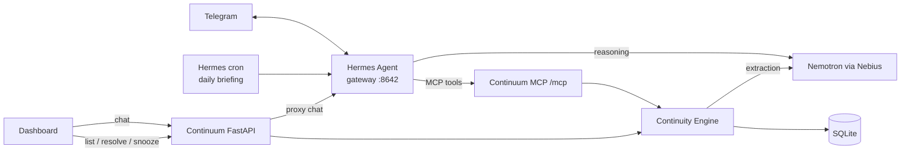

# Continuum

**A personal AI that remembers what's still unfinished.**

You mention things in passing: "Sarah said she'll get back to me Friday", "I need to finish my portfolio". Then they slip. Notes apps keep what you wrote. Chatbots forget it by the next session. Continuum pulls the **open loops** out of normal conversation (tasks, your promises, things you're waiting on, deadlines), links them to your goals, keeps them until they're done, and tells you before they slip.

Built for the Nebius x NVIDIA Global AI Hackathon, **Personal AI** track.

## What it does

1. Tell it: *"I'm applying for an NVIDIA internship. Sarah said she'll get back to me next Friday. I also need to finish my portfolio."*
2. It saves the goal **Secure NVIDIA internship** with 2 loops: **Wait for Sarah's response** (due Fri) and **Finish portfolio**.
3. The dashboard groups loops under goals and shows due dates, with overdue items in red. Click a loop to see **the exact sentence it came from**.
4. Restart everything, then ask *"What am I waiting on?"* and it answers from its database.
5. Say *"Sarah got back to me!"* or click **Resolve**, and the loop closes. When the whole goal is finished, click **Mark goal done**.

### Before things slip

- **Needs attention.** The top of the dashboard lists what's overdue, due today or tomorrow, or hasn't been touched for 4 days (`STALE_DAYS`). Plain rules, no LLM, so it's instant and predictable. Ask *"What's urgent?"* in chat for the same list.
- **Snooze.** Hide a loop until Tomorrow, In 3 days, Next Monday or any date, from the dashboard or in chat (*"snooze the portfolio till Monday"*). It comes back on that day.
- **Drafts.** Click **Draft** (or ask *"draft a follow-up to Sarah"*) and Continuum writes a short message for you to copy. It never sends anything.
- **Telegram.** The same assistant on your phone: capture loops on the go, ask what's urgent. [Setup](#telegram-optional).
- **Daily briefing.** Every morning, a short Telegram message with what needs you. Reply to it to snooze, resolve or draft. [Setup](#daily-briefing-optional-needs-telegram).

## Architecture



- **Continuum** (one Python process): FastAPI serves the dashboard, a REST API, and an MCP server at `/mcp/`. The continuity engine (`app/engine.py`) owns extraction, goal linking, dedup, the attention rules and storage.
- **Hermes Agent** (second process) is the chat brain, for the dashboard chat, Telegram and the daily briefing. It decides when to save (`remember`) and when to answer from memory (`list_open_loops`, `needs_attention`, `list_goals`, `inspect_loop`, `resolve_loop`, `snooze_loop`). Proposals wait for your yes (`list_pending_actions`, `approve_action`, `reject_action`). With a Tavily key it can look things up (`web_lookup`) and watch a loop on the web (`watch_loop`); what it finds only becomes a proposal (`propose_loop_update`). With Google connected it proposes calendar events and Gmail drafts (`propose_calendar_event`, `propose_gmail_draft`), created only after your yes. It runs in its own `continuum` profile, so your default Hermes setup is untouched. Its built-in terminal, file, web, browser and memory tools are off on every platform. It only has Continuum's tools.

### Why Hermes

Continuum should hold a real conversation and decide for itself whether a message is something to remember, a question, or a status update. Hermes gives us that agent loop, conversation history and an OpenAI-style API server. Continuum stays the single source of truth through MCP, so there's no second memory to drift out of sync.

### Nemotron on Nebius

Both the agent and the extraction run on **NVIDIA Nemotron** (`nvidia/nemotron-3-super-120b-a12b`) through **Nebius Token Factory**:

- **Hermes** uses it for reasoning and tool calls.
- **Extraction** (`app/extraction.py`) sends Nemotron the message, the current date/timezone and your existing goals and open loops. Nemotron returns JSON (in JSON mode) with new goals, new loops, updates and resolutions. Pydantic validates it. Invalid output gets one retry with the error attached, then fails cleanly.

The engine then drops any ids the model invented, dedups by normalized title, and writes everything in **one transaction**. A failure writes nothing.

## Setup

Needs **Python 3.11+**, **[Hermes Agent](https://hermes-agent.nousresearch.com)** (tested with 0.21) on your PATH, and a **Nebius API key**.

**macOS / Linux**

```bash
python -m venv .venv && .venv/bin/pip install -r requirements.txt -e .
cp .env.example .env                                # then set NEBIUS_API_KEY
.venv/bin/python scripts/setup_hermes.py            # creates the Hermes "continuum" profile
.venv/bin/uvicorn app.main:app                      # terminal 1: Continuum on :8000
hermes -p continuum gateway run                     # terminal 2: Hermes on :8642
```

**Windows (PowerShell)**

```powershell
python -m venv .venv; .venv\Scripts\pip install -r requirements.txt -e .
copy .env.example .env                              # then set NEBIUS_API_KEY
.venv\Scripts\python scripts\setup_hermes.py
.venv\Scripts\uvicorn app.main:app                  # terminal 1
hermes -p continuum gateway run                     # terminal 2
```

Open **http://127.0.0.1:8000**. Re-run `setup_hermes.py` after changing keys or the model, and after updating Continuum (it copies new tools and instructions into Hermes).

Optional: `TAVILY_API_KEY` in `.env` for web watch and lookup (free key at tavily.com). Then say "keep an eye on the hackathon results", or use **Watch the web** in a loop's detail. `python scripts/sync.py` runs the check: each watched loop is searched at most once a day, and anything found shows under **Pending actions**.

`requirements.txt` pins the tested versions; `-e .` installs Continuum itself so the scripts can import it.

On Windows the Hermes installer puts `hermes.exe` in `%LOCALAPPDATA%\hermes\bin`. If `hermes` isn't found, add that folder to your PATH.

To try the UI without an LLM, fill a scratch database with sample data: set `DATABASE_URL=sqlite:///./data/seed.db`, then run `python scripts/seed_demo.py` and start uvicorn with the same `DATABASE_URL`.

### Telegram (optional)

Chat with Continuum from your phone. Hermes runs the bot, so there's no extra server and no public URL.

1. In Telegram, message **@BotFather**, send `/newbot`, and copy the token. Make a new bot just for Continuum: one token can't serve two running gateways.
2. Message **@userinfobot** to get your numeric user id. (Not the number at the start of the bot token: that's the bot's id.)
3. In `.env`, set `TELEGRAM_BOT_TOKEN=<token>` and `TELEGRAM_ALLOWED_USERS=<your id>`.
4. Re-run `python scripts/setup_hermes.py`, then restart `hermes -p continuum gateway run`.
5. Message your bot, e.g. *"What am I waiting on?"*

Only the user ids in `TELEGRAM_ALLOWED_USERS` get replies. On Telegram, Continuum has the same tools as the dashboard chat, nothing else. Telegram keeps one ongoing conversation; send `/new` to start fresh.

### Daily briefing (optional, needs Telegram)

Every morning at 8:00 in your `TIMEZONE`, Continuum sends what needs attention to Telegram. Reply to it to snooze, resolve or draft a follow-up. Create the job once:

```bash
hermes -p continuum cron create "0 8 * * *" "$(cat hermes/briefing_prompt.md)" --deliver telegram --name briefing
```

```powershell
hermes -p continuum cron create "0 8 * * *" (Get-Content hermes\briefing_prompt.md -Raw) --deliver telegram --name briefing
```

The gateway (`hermes -p continuum gateway run`) must be running for it to fire. To try it now: `hermes -p continuum cron list` shows the job id, and `hermes -p continuum cron run <id>` sends it within a minute.

### Email and web sync on Telegram (optional, needs Telegram plus Google or Tavily)

Every 10 minutes Continuum reads new email from people linked to open loops, and once a day it checks each loop you asked it to watch on the web. It sends what changed to Telegram: loops an email closed or updated (undo in the dashboard), a calendar event when an email sets a date and time, and web findings. Events and web findings wait for your "yes" or "no". Create the job once, after `setup_hermes.py` (it installs the script the job runs):

```bash
hermes -p continuum cron create "every 10m" --no-agent --script continuum_sync.py --deliver telegram --name sync
```

The job runs `scripts/sync.py` without the LLM agent. Telegram only gets a message when something changed or was found, or when a check failed (the same error is sent once, not every 10 minutes). Re-run `setup_hermes.py` after moving the project.

### Google setup (optional)

Lets Continuum read email from people you're waiting on and, with your yes, save Gmail drafts and calendar events. It never sends email.

1. In [Google Cloud Console](https://console.cloud.google.com/), create a project and enable the **Gmail API** and the **Google Calendar API**.
2. Under **Google Auth Platform**, set the audience to **External** and add your Google account as a **test user**.
3. Under **Clients**, create a client of type **Desktop app**. Download its JSON and save it as `data/client_secret.json`.
4. In the dashboard, open **Settings** and click **Connect Google**. Your browser opens Google's sign-in.
5. Give someone's address, in chat (*"Sarah's email is sarah@nvidia.com"*) or in a loop's **Contact email**. From then on, `python scripts/sync.py` (or the cron job above) reads their new email and updates their loops. The first run reads the last 7 days (`SYNC_LOOKBACK_DAYS`).

To check the connection on its own: `python scripts/google_gate.py someone@example.com` lists the last 5 emails from that address, saves a test draft (not sent) and creates a test event tomorrow at 10:00. Delete both afterwards.

Access asked for: read Gmail, write drafts, write calendar events. The token is saved in `data/google_token.json` (gitignored). While the Google app is in testing, Google ends the connection after 7 days: connect again in Settings. **Disconnect** in Settings revokes access and deletes the token.

## Tests

```bash
pytest            # offline: LLM and Hermes are mocked
pytest -m live    # real Nemotron + Hermes + Tavily (needs keys and both servers running)
```

The live suite runs the acceptance inputs against real Nemotron, e.g. "Alex said he'll send me the dataset tomorrow" (a waiting loop due tomorrow), "The weather was nice today" (nothing saved), the same message twice (one loop), and "Alex sent the dataset" (loop resolved).

## Privacy

- Everything stays local in `data/continuum.db` (SQLite). What leaves your machine: text sent to Nebius for Nemotron to do its job; your Telegram messages if you turn Telegram on (they pass through Telegram's servers); with a Tavily key, only your watch searches and lookup questions go to Tavily, never your messages. Only the names of people you wait on go to the model, not their email addresses.
- **Email** (if you connect Google): only mail *from* people you gave an address for, and only while they have an open loop. Continuum never lists or searches the rest of your inbox. Each email's subject and new text (quotes and signature removed, at most 4,000 characters) go to Nemotron. The text is stored only if it changed a loop. Attachments are never downloaded. **Forget email data** in Settings deletes all stored email text; loops made from it stay, marked "source deleted".
- Every loop links to the message it came from, and you can delete any loop.
- Continuum never sends anything on your behalf. Drafts are text for you to copy, or Gmail drafts you send yourself.
- Messages that change nothing (questions, small talk) aren't stored by Continuum. Hermes keeps its own chat history in its `continuum` profile folder.
- Logs record event names, counts and ids (`extraction_ok`, `loop_created`, `loop_resolved`, `email_synced`), never message content, email subjects or API keys.

## Limitations

- **One user, no auth.** Run it on your own machine only.
- **Extraction is an LLM's judgment.** It can miss an item or misread a date. "Before Friday" may come back as Thursday or Friday. Every loop shows its source text so you can check it, and wrong loops can be deleted.
- **`next_action` is usually empty**, because the model is told never to invent anything the message doesn't state.
- **Dedup is exact-match** on normalized title + person, plus giving the model the existing loops. Reworded duplicates can slip through.
- **Hermes' standalone gateway** (`gateway.standalone: true`) is a shim Hermes marks as temporary. `hermes/config.example.yaml` describes the fallback.
- Goals are marked done from the dashboard only, not by chat.
- Chat replies take a few seconds (one Nemotron tool call plus the reply, ~3–9 s in testing).
- Telegram and the daily briefing only work while Hermes' gateway is running on your machine.
- Scheduled jobs (the daily briefing, web watch) only run while the gateway is running. A briefing missed while it was off is sent once when the gateway starts again, so it can arrive late.

## License

[MIT](LICENSE)
