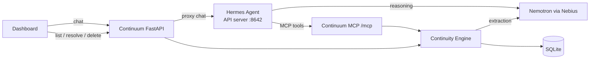

# Continuum — Phase 1 Spec

**Track:** Personal AI — Nebius x NVIDIA Global AI Hackathon
**Agent runtime:** Hermes Agent (Nous Research)
**LLM:** NVIDIA Nemotron via Nebius Token Factory

> Continuum doesn't just remember what you said. It remembers what's still unfinished.

Core idea: an **Open Loop** is an unresolved task, promise, or thing you're waiting on, taken from normal conversation.

---

## 1. Success Story (the demo)

Phase 1 is done when this works end to end, with real Nemotron calls:

1. User types:
   > I'm applying for an NVIDIA internship. I submitted my application yesterday. Sarah said she'll get back to me next Friday. I also need to finish my portfolio before the interview.
2. Continuum replies: saved goal **Secure NVIDIA internship** and 2 loops: **Wait for Sarah's response** and **Finish portfolio**.
3. The dashboard shows the goal with its 2 open loops.
4. Click "Wait for Sarah's response". It shows who, the due date, the next action, and the **original sentence it came from**.
5. Restart everything.
6. Ask: *"What am I waiting on?"* → *"Sarah's response about the NVIDIA internship, due Fri Oct 2."*
7. Say *"Sarah got back to me, I got the interview!"* (or click Resolve) → the loop is resolved and the dashboard updates.

---

## 2. Architecture



- **Hermes is the chat brain.** It decides when to save (`remember`) and when to answer from memory (`list_open_loops`). This covers both "remember this" and "what am I waiting on?".
- **The Continuity Engine owns the domain logic**: extraction, goal linking, dedup, and persistence. Hermes only calls it through tools.
- Continuum runs as **one process**: FastAPI serves the REST API, the static UI, and an MCP endpoint at `/mcp/` (streamable HTTP, MCP SDK 2.x `MCPServer`).
- Hermes runs as a second process in its own **`continuum` profile** (`hermes -p continuum gateway run`), so the user's default Hermes setup is untouched. `python scripts/setup_hermes.py` creates the profile from `.env` + `hermes/`. Nebius and DeepSeek are both built-in Hermes providers.
- **Hermes built-in toolsets are off** (terminal, file, browser, web, memory). Continuum tools only. Checked via Hermes' `GET /v1/toolsets`.
- Hermes 0.21 facts:
  - One host gateway per machine by default, so the profile uses `gateway.standalone: true` (a shim Hermes marks as temporary; the fallback is in `hermes/config.example.yaml`).
  - `tools.tool_search.enabled: "off"`: otherwise MCP tools are hidden behind `tool_search`/`tool_call` and each reply takes several extra model calls.
  - Tool names reach the model as `mcp__continuum__<tool>`. Tool docstrings in `app/mcp_tools.py` and `hermes/SOUL.md` together decide which tool Hermes picks.
- `remember` doesn't store messages that change nothing (e.g. questions), in line with §10.

MCP tools exposed to Hermes:

| Tool | Does |
|---|---|
| `remember(text)` | Runs `engine.process_message`, returns what was created, updated, or resolved |
| `list_open_loops(goal?)` | Open loops, grouped by goal |
| `list_goals()` | Active goals + open loop counts |
| `inspect_loop(id)` | Full loop + source text |
| `resolve_loop(id)` | Marks it resolved |

---

## 3. Scope

**In:** chat → extraction → persisted goals and loops → view, inspect, resolve, reopen, delete → survives restart.

**Out (Phase 2+):** Gmail, Calendar, Slack, GitHub, Telegram, notifications, background jobs, auto follow-ups, vector DB, knowledge graph, auth, multi-user, voice, mobile, fine-tuning, browser automation, analytics.

---

## 4. Data Model (SQLModel, SQLite)

```python
Source:
    id: UUID
    kind: str = "chat"         # Phase 3 adds "email"; costs nothing to add now
    text: str                  # raw user message
    created_at: datetime

Goal:
    id: UUID
    title: str
    description: str | None
    status: "active" | "done"
    created_at, updated_at

OpenLoop:
    id: UUID
    goal_id: UUID | None
    source_id: UUID            # provenance, required
    title: str                 # "Wait for Sarah's response"
    summary: str
    kind: "task" | "waiting" | "commitment"
    waiting_on: str | None     # "Sarah"
    due: date | None           # any kind can have a deadline
    next_action: str | None
    status: "open" | "resolved"
    created_at, updated_at, resolved_at
```

Deliberately simple:
- `kind` and `status` don't overlap. "Waiting" is a kind, not a status.
- A deadline is just the `due` field, not a separate kind.
- No `cancelled` status. Wrong loops get deleted.
- No LLM confidence score. Self-reported confidence is noise. Validation + user delete is the safety net.

---

## 5. Extraction

`extraction.py` holds the prompt, the Pydantic schemas, and `extract()`. No prompt strings anywhere else.

**Input to Nemotron:**
- current datetime + user timezone (`TIMEZONE` env)
- the user message
- existing **active goals** (id, title) and **open loops** (id, title, waiting_on, due)

**Output (JSON, validated by Pydantic):**

```json
{
  "goals":        [{"title": "...", "description": "..."}],
  "new_loops":    [{"title": "...", "summary": "...", "kind": "waiting",
                    "waiting_on": "Sarah", "due": "2026-10-02",
                    "next_action": "...", "goal": "Secure NVIDIA internship"}],
  "updated_loops":[{"id": "...", "due": "...", "next_action": "...", "summary": "..."}],
  "resolved_loop_ids": ["..."]
}
```

**Prompt rules:**
1. You are an extraction engine, not an assistant. Return JSON only.
2. Extract only what the message states. Never invent people, dates, or commitments. Unknown = `null`.
3. Ignore facts with no future action ("I like pizza", "the meeting went well").
4. Goals = outcomes the user wants. Loops = concrete unresolved items.
5. Detect: tasks, the user's own promises, other people's promises, things the user is waiting on, and explicit deadlines.
6. Resolve relative dates to ISO using the current date. "Friday" / "next Friday" = the nearest upcoming Friday. If unsure, use `null`.
7. If the message refers to an existing loop, put it in `updated_loops`. Do not create a duplicate.
8. Put a loop in `resolved_loop_ids` only if the message clearly says it's done.
9. When a loop belongs to an existing goal, reuse that goal's exact title.

**Call settings:** use JSON mode (`response_format`) if Nebius supports it for the model. On invalid JSON or a validation error, retry once with the error attached, then fail.

---

## 6. Continuity Engine

`engine.process_message(text) -> ChangeSet`:

```text
extract (LLM, no DB writes yet)
→ validate
→ drop any updated/resolved ids not in the list we sent (hallucination guard)
→ ONE transaction: save Source, upsert goals, create/update/resolve loops
→ return ChangeSet(created_goals, created_loops, updated_loops, resolved_loops)
```

**Dedup:** mostly handled by passing existing items to the LLM (rule 7). Safety net: before inserting, skip a new loop if an open loop exists with the same normalized title (lowercase, trimmed, whitespace collapsed) and the same `waiting_on`. Goals match on normalized title. No token similarity or embeddings.

Other engine functions: `list_goals`, `list_loops(status, goal_id)`, `get_loop`, `resolve_loop`, `reopen_loop`, `delete_loop`.

---

## 7. LLM Client (`llm.py`)

- Use the `openai` SDK with the provider's `base_url`. It already handles auth, timeouts, and retries.
- `LLM_PROVIDER=nebius` (default, the real target) or `deepseek` (dev stand-in while there's no Nebius key; model `deepseek-flash`). **The final demo and submission must use Nebius Nemotron.**
- `NEBIUS_MODEL` is configurable. Pick a Nemotron model from the Nebius catalog with solid tool calling, since Hermes uses it too.
- Log the model name and latency. Never log keys or full user messages.

---

## 8. REST API

```http
GET    /health
POST   /api/chat                 {message} → {reply}   (proxies to Hermes)
GET    /api/goals                → goals + open loop counts
GET    /api/loops?status=&goal_id=
GET    /api/loops/{id}           → loop + source text
POST   /api/loops/{id}/resolve
POST   /api/loops/{id}/reopen
DELETE /api/loops/{id}
```

Routes stay thin and call the engine. After each chat reply, the UI re-fetches lists instead of parsing the reply.

Errors are JSON: `{"error": "extraction_failed", "message": "..."}`. If Hermes is down, `/api/chat` returns `{"error": "agent_unavailable"}`.

---

## 9. UI (`app/static/index.html`, vanilla JS, no build step)

One page, two columns:

```text
┌─ Talk to Continuum ────────┐ ┌─ Open loops ──────────────────────┐
│ chat history               │ │ ▸ Secure NVIDIA internship (2)    │
│                            │ │   ⏳ Wait for Sarah   Fri Oct 2    │
│                            │ │   ☐ Finish portfolio              │
│ [ type here...      ][Send]│ │ ▸ No goal (1)                     │
└────────────────────────────┘ │ [ ] show resolved                 │
                               └───────────────────────────────────┘
```

- Loops are **grouped under their goal**, one list instead of two.
- Due dates are shown as friendly text ("Fri Oct 2 · in 3 days"). Overdue items are shown in red.
- New or changed loops briefly highlight after a chat.
- Click a loop to open a detail panel: fields + **"Why Continuum knows this"** (the original sentence and timestamp) + **Resolve / Reopen / Delete**.
- Empty state shows an example message to try.

---

## 10. Privacy, Logging, Failures

- Data stays local in `data/continuum.db`. Never commit `.env` or `*.db`.
- Every loop links to its source text, and every loop can be deleted.
- Logs record event names (`extraction_ok`, `loop_created`, `loop_resolved`, `extraction_failed`) and ids, not message content.
- Extraction or LLM failure → nothing is written (see §6), with a clear error.
- Never swallow exceptions silently.

`.gitignore`: `.env`, `*.db`, `__pycache__/`, `.pytest_cache/`, `.venv/`

---

## 11. Tests (pytest, LLM mocked)

- **Extraction parsing:** valid JSON → models. Malformed → one retry → error. Unknown ids get dropped.
- **Engine:** creates goal + loops, links them, dedups a repeated message, resolves via `resolved_loop_ids`, and writes nothing on failure.
- **Persistence:** create → new session/engine → still there.
- **Resolve/reopen:** status and `resolved_at` are correct.
- **API:** every endpoint in §8 (Hermes proxy mocked).
- **Live (optional):** `@pytest.mark.live`, skipped without `NEBIUS_API_KEY`. Runs the acceptance inputs below against real Nemotron.

**Acceptance inputs** (manual + live test):

| Input | Expect |
|---|---|
| "Alex said he'll send me the dataset tomorrow." | waiting, waiting_on=Alex, due=tomorrow |
| "I need to finish the presentation before Friday." | task, due=Friday |
| "The weather was nice today." | nothing saved |
| "Sarah said she'll respond Friday." ×2 | one loop |
| "Alex sent the dataset." | Alex loop resolved |

---

## 12. Repo Layout

```text
app/
  main.py         # FastAPI: routes, static files, mounts MCP at /mcp
  config.py       # env settings (pydantic-settings)
  db.py           # SQLModel tables + session
  llm.py          # Nebius client
  extraction.py   # prompt + schemas + extract()
  engine.py       # continuity engine
  mcp_tools.py    # MCP tools for Hermes
  hermes.py       # client for Hermes API server (chat proxy)
  static/index.html
hermes/
  config.example.yaml   # Nebius provider + Continuum MCP + disabled toolsets
scripts/seed_demo.py    # seed data for UI work (not the real demo)
tests/
data/.gitkeep
.env.example  README.md  LICENSE (MIT)  pyproject.toml  AGENTS.md
```

Add files only when one gets too big.

`.env.example`:

```bash
LLM_PROVIDER=nebius            # or deepseek (dev stand-in)
NEBIUS_API_KEY=
NEBIUS_BASE_URL=https://api.tokenfactory.nebius.com/v1/
NEBIUS_MODEL=nvidia/nemotron-3-super-120b-a12b
DEEPSEEK_API_KEY=
DEEPSEEK_BASE_URL=https://api.deepseek.com
DEEPSEEK_MODEL=deepseek-flash
HERMES_API_URL=http://localhost:8642/v1
TIMEZONE=Asia/Kuala_Lumpur
DATABASE_URL=sqlite:///./data/continuum.db
```

Model: start with `nemotron-3-super-120b-a12b` (good tool calling, used by Hermes too). If extraction is slow, try `nvidia/nvidia-nemotron-3-nano-30b-a3b` for extraction only. Confirm the ids in your Nebius console.

Hermes setup lives in `hermes/`: `config.example.yaml` (provider, MCP server at `http://127.0.0.1:8000/mcp/`, tool allowlist, toolsets off, memory off, standalone gateway) and `SOUL.md` (Continuum's persona). `scripts/setup_hermes.py` merges them into the `continuum` profile and writes the keys. Add new MCP tools to `tools.include` there.

---

## 13. Build Order

Each step ends with passing tests. **Steps 2 and 3 are gates: don't continue until they work for real.**

- [x] **1. Bootstrap:** FastAPI + config + SQLModel tables + engine CRUD (no LLM) + `/health` + tests.
  *Done 2026-09-29: 11 tests pass; `/health` checked on a real server.*
- [x] **2. Nebius gate:** a real Nemotron call succeeds through `llm.py`.
  *Done 2026-09-29: `nvidia/nemotron-3-super-120b-a12b` via Nebius, plain + JSON mode. No `<think>` text leaks; the client strips leading newlines.*
- [x] **3. Hermes gate (biggest risk, do it early):** install Hermes, point it at Nebius Nemotron, connect a dummy MCP tool at `/mcp`, and call it through the Hermes API server. Save the working config to `hermes/config.example.yaml`.
  *Done 2026-09-29, first with DeepSeek, then rechecked on Nebius Nemotron: 3/3 runs, each a real `POST /mcp/` to Continuum. Hermes 0.21.5 `continuum` profile; built-in toolsets confirmed off. The live test uses a fresh conversation per run so Hermes can't answer from history.*
- [x] **4. Extraction + `process_message`** with mocked tests, then the live acceptance inputs.
  *Done 2026-09-29: 12 mocked tests (parsing, retry, dedup, update/resolve, invented-id guard, nothing written on failure). All 5 live acceptance scenarios + the §1 demo message pass on Nemotron, 3 runs in a row (15/15). Each extraction takes ~2–7 s. Note: `next_action` usually comes back null, because rule 1 forbids inventing it. Revisit if the detail view feels empty.*
- [x] **5. Real MCP tools** wired to the engine. Hermes answers "what am I waiting on?" from the DB.
  *Done 2026-09-29: the 5 tools in §2 (`ping` removed). 6 MCP-over-HTTP tests. Checked live on Nemotron against a scratch DB: demo message → `remember` saved 1 goal + 2 loops. Then, **after restarting Continuum**, fresh conversations answered "What am I waiting on?" (`list_open_loops`), "Why do you know that?" (`inspect_loop`, quoting the original words) and "Sarah got back to me" (`resolve_loop`). One tool call per reply, ~3–9 s. Changes found along the way: Hermes' **tool search** (on by default) hid MCP tools behind extra round-trips, so it's now off in `hermes/config.example.yaml`. A message that changes nothing is no longer stored.*
- [ ] **6. REST API + UI.**
- [ ] **7. E2E:** run the §1 demo, restart, and confirm memory persists.
- [ ] **8. README:** one-liner, problem, architecture diagram, why Hermes, Nemotron/Nebius usage, setup (both processes, Windows + macOS/Linux), tests, privacy, track, license.

If a Hermes or Nebius API differs from this spec, follow the official docs and update this file.

---

## 14. Done Checklist

- [ ] §1 demo works with real Nemotron via Nebius, through Hermes. *(Chat steps 1, 2, 5, 6, 7 verified through Hermes; dashboard steps 3–4 wait on Step 6.)*
- [ ] Data survives restart. *(Engine level tested; still needs the E2E check.)*
- [ ] Every loop shows its source text. Resolve / reopen / delete work. *(Engine done; API + UI pending.)*
- [ ] Repeated info doesn't duplicate. *(Engine + live test pass; still needs the E2E check.)*
- [ ] `pytest` passes without network. *(True so far; recheck at the end.)*
- [ ] Clean clone → running in ≤ 5 commands per README
- [ ] No `.env` or `.db` in git. *(`.gitignore` confirmed working; nothing committed yet.)*
- [ ] README states real limitations honestly

**Do not start Phase 2** (proactive follow-ups, stale-loop detection, integrations) until every box is checked.
