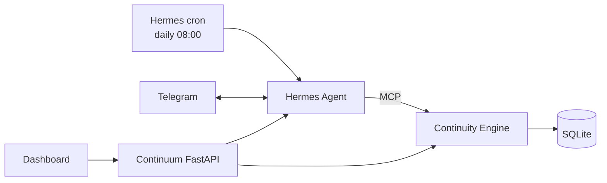

# Continuum — Phase 2 Spec: Proactive

**Needs:** every box in Phase 1 §14 checked.

> Phase 1 remembers what's unfinished. Phase 2 **tells you before it slips.**

Most of this phase uses features Hermes already has (cron, Telegram). We add a little code: rules for what needs attention, and snoozing.

---

## 1. Success Story (the demo)

1. Phase 1 state: "Wait for Sarah's response" is due Fri Oct 2.
2. The morning of Oct 2, a Telegram message from Continuum:
   > Good morning. 2 things need you:
   > • **Sarah's reply (NVIDIA)**: due today
   > • **Finish portfolio**: no update in 5 days
3. User replies in Telegram: *"Draft a follow-up to Sarah."* → Hermes writes a short, polite email draft. The user copies and sends it themselves.
4. User: *"Snooze the portfolio till Monday."* → it's hidden until Monday.
5. User, on the go: *"Alex promised me the slides by Thursday."* → a new loop, saved from Telegram.
6. The dashboard shows a **Needs attention** section at the top with the same items. Each has **Snooze** and **Draft follow-up** buttons.

---

## 2. Architecture Changes



- **No background worker in Continuum.** Hermes cron does the scheduling.
- **Telegram** runs through the Hermes gateway, so it's a second chat interface to the same MCP tools. We write no Telegram code.
- **Follow-up drafts** come from Hermes itself (it's an LLM, and `inspect_loop` gives it the context). No new prompt or endpoint. The dashboard button just sends a chat message.
- **Continuum never sends messages on the user's behalf.** Drafts only.

---

## 3. Scope

**In:** attention rules, daily briefing via Hermes cron → Telegram, snooze, follow-up drafts, Telegram chat, Needs-attention UI.

**Out (Phase 3+):** Gmail/Calendar, sending anything automatically, learned habits, vector search, multi-user.

---

## 4. Data Model Changes

```python
OpenLoop:
    + snoozed_until: date | None
```

That's the only schema change.

**Migration:** Phase 1 used `create_all`, which doesn't add columns. Add `db.migrate()`, run at startup. It checks `PRAGMA table_info(openloop)` and runs `ALTER TABLE ... ADD COLUMN` for missing columns. Don't add Alembic for one column.

---

## 5. Attention Rules (`engine.needs_attention(today)`)

Plain rules, no LLM. Open loops only. Skip a loop if `snoozed_until > today`.

| Rule | Condition | Reason text |
|---|---|---|
| Overdue | `due < today` | "overdue by N days" |
| Due soon | `today ≤ due ≤ today+1` | "due today" / "due tomorrow" |
| Stale wait | `kind=waiting`, no `due`, `updated_at` older than `STALE_DAYS` | "waiting N days, no reply" |
| Stale task | `kind in (task, commitment)`, no `due`, `updated_at` older than `STALE_DAYS` | "no update in N days" |

- Sort: overdue → due soon → stale. Within each group, oldest first.
- Return `[{loop, reason}]`.
- `today` uses `TIMEZONE`. The function takes `today` as a parameter so tests can fix the date.
- New env: `STALE_DAYS=4`.
- `updated_at` changes whenever a loop is updated (by chat, snooze, or reopen), so mentioning a loop again resets the stale timer. That's intended.

---

## 6. MCP Tools (added)

| Tool | Does |
|---|---|
| `needs_attention()` | Runs the rules for today |
| `snooze_loop(id, until)` | Sets `snoozed_until`. Hermes turns "till Monday" into a date |

Add both to the Hermes `tools.include` list.

**Tool descriptions matter.** Write them so Hermes knows: use `needs_attention` for "what should I do / what's urgent", and use `list_open_loops` for "what am I waiting on / show everything".

---

## 7. Daily Briefing (Hermes cron)

Set up once. Document the exact command in the README:

```bash
hermes cron create "every day at 08:00" "<briefing prompt>" --deliver telegram
```

Keep the briefing prompt in `hermes/briefing_prompt.md`:
- Call `needs_attention`.
- If it's empty, send one line: "Nothing urgent today."
- Otherwise send a short list (≤ 6 items): bold title, (goal), reason. End with: "Reply to snooze, resolve, or draft a follow-up."
- No extra chit-chat.

**Check in Hermes docs:** exact schedule syntax, the timezone the cron uses, and whether the cron platform needs MCP tools enabled (`hermes tools` → cron). Update this section with what works.

---

## 8. Telegram

- Set up the Hermes Telegram platform (bot token from @BotFather). Allow only the user's own chat id.
- Telegram and the dashboard share the same MCP tools, so they always show the same state.
- Put setup steps in the README. Token goes in Hermes config/env, **never** in this repo.

---

## 9. REST API (added)

```http
GET  /api/attention               → [{loop, reason}]
POST /api/loops/{id}/snooze       {until: "2026-10-05"}
POST /api/loops/{id}/unsnooze
```

`GET /api/loops` hides snoozed loops by default. `?include_snoozed=true` shows them.

---

## 10. UI Changes

```text
┌─ Needs attention (2) ─────────────────────────────────────┐
│ ⚠ Sarah's reply · NVIDIA · due today   [Draft] [Snooze ▾] │
│ • Finish portfolio · no update 5 days  [Draft] [Snooze ▾] │
└───────────────────────────────────────────────────────────┘
  ... Phase 1 layout below ...
```

- Snooze menu: Tomorrow / In 3 days / Next Monday / Pick date.
- **Draft** sends `Draft a follow-up for loop <id>` to `/api/chat`. The reply shows in the chat panel with a **Copy** button.
- Snoozed loops show "💤 until Mon" when "show snoozed" is on.
- Hide the section when it's empty.

---

## 11. Tests

- **Attention rules**, with a fixed `today`: each rule fires, the boundaries (`due == today`, exactly `STALE_DAYS`) behave, snoozed loops are skipped, resolved loops never appear, and the sort order is right.
- **Snooze:** set/unsnooze, `updated_at` bumps, the list filter hides snoozed loops.
- **Migration:** a Phase 1 DB file (without `snoozed_until`) → `migrate()` → column exists, data kept, and running it twice is safe.
- **API:** new endpoints.
- **Manual:** trigger the cron job now (`hermes cron run <id>` or the docs equivalent) → the Telegram message arrives.

---

## 12. Build Order

1. `snoozed_until` + `migrate()` + tests.
2. `needs_attention()` + tests.
3. REST endpoints + UI section.
4. MCP tools → check in Hermes chat: "what's urgent?" / "snooze X till Monday".
5. **Telegram gate:** chatting with Continuum through Telegram works.
6. Cron briefing → trigger it by hand, check delivery. Then schedule it.
7. Run the §1 demo. Add a Phase 2 section to the README.

---

## 13. Done Checklist

- [ ] Briefing arrives on Telegram at the scheduled time, with correct items
- [ ] Empty day → "Nothing urgent today."
- [ ] Snooze via Telegram and dashboard; snoozed loops come back after the date
- [ ] "Draft a follow-up" works in both, and nothing is sent automatically
- [ ] New loops can be captured from Telegram
- [ ] A Phase 1 DB upgrades without data loss
- [ ] `pytest` passes offline
- [ ] No bot token or chat id in git
