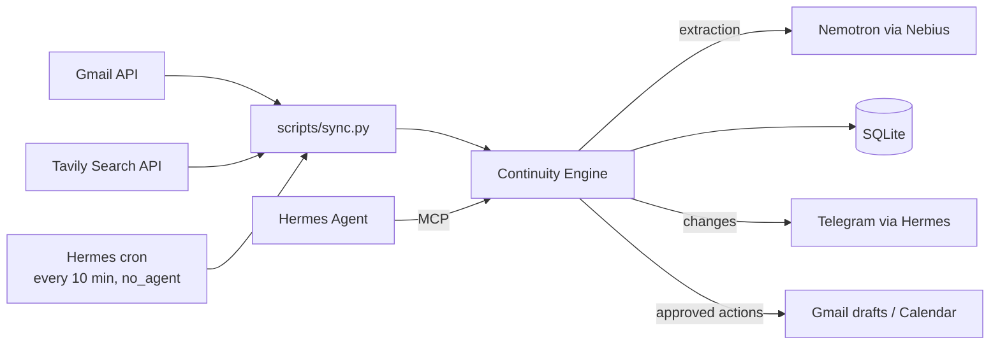

# Continuum — Phase 3 Spec: Connected

**Needs:** every box in Phase 2 §13 checked.

> Phase 2 nudges you. Phase 3 **notices on its own when a loop closes**, in your email or on the web, and can prepare the next step for your approval.

---

## 1. Success Story (the demo)

1. Open loop: "Wait for Sarah's response" (waiting_on = Sarah, sarah@nvidia.com).
2. Sarah emails: *"Great news, we'd like to interview you on Oct 8 at 10am."*
3. Within ~10 minutes, a Telegram message from Continuum:
   > Sarah replied. ✅ Closed **Wait for Sarah's response**.
   > New: **Prepare for NVIDIA interview**, due Oct 8.
   > Add "NVIDIA interview" to your calendar, Oct 8 10:00? (yes/no)
4. User: *"yes"* → the calendar event is created.
5. Dashboard: the loop shows **Source: email from Sarah** with a link to the thread, plus an **Undo** button on the auto-close.
6. Later: *"Draft a thank-you reply to Sarah"* → a **Gmail draft** is created in the thread. The user reviews and sends it from Gmail.
7. User: *"Keep an eye on the hackathon results."* → Continuum watches the web for **Wait for hackathon results** (Tavily).
8. The day the results are posted, Telegram:
   > Found on the web: hackathon winners announced (devpost.com/…). Resolve **Wait for hackathon results**? (yes/no)

   *"yes"* → resolved, with the page linked in the activity timeline.
9. *"When does the Google STEP application close?"* → Hermes looks it up and answers with the link. *"Set that as the deadline"* → a proposal; the user approves it.

---

## 2. Principles for this Phase

- **Read little.** Only process emails from people linked to open loops. Never scan the whole inbox. Only search the web for loops the user chose to watch, or when they ask.
- **The web can only propose.** An email from a linked person may change its loops directly (with undo). Web pages are untrusted, so a web finding never changes a loop without the user's yes.
- **Never send.** Email becomes a Gmail *draft*. Only calendar events are created directly, and only after an explicit yes.
- **Everything is visible and undoable.** Every automatic change is logged and can be reverted.
- **Minimal OAuth scopes.**

---

## 3. Architecture Changes



- **Polling, not webhooks.** A Hermes cron job in script-only mode (`no_agent`) runs `python scripts/sync.py` every 10 min. No LLM cost when nothing's new, and no public URL needed.
- If sync changed anything, the script prints a summary. Hermes delivers stdout to Telegram, and prints nothing when nothing changed. **Check in the docs** that empty output means no message. If not, have the script exit early and document it.
- **Connectors** are thin wrappers in `app/connectors/`. Domain logic stays in the engine.
- Before building, **check whether Hermes or a well-maintained MCP server already offers Gmail/Calendar access.** Only use it if it supports reading by sender and creating drafts. Otherwise build our own. Ingestion into the engine is ours either way.
  *Checked 2026-10-06: Hermes reaches Gmail/Calendar only through Codex plugins or Google's MCP servers. Both give the agent access, not `sync.py`, and the agent shouldn't read mail directly (same reason as the web). So we build our own: `app/connectors/google.py`, OAuth via `google-auth-oauthlib` (Desktop app flow + token refresh), API calls via `httpx`.*
- *No-agent cron, checked in the Hermes 0.21 docs and source: empty stdout = no message; non-zero exit = an error alert; stderr is shown only on failure. Scripts must live in the profile's `scripts/` folder and run with Hermes' own Python, so `setup_hermes.py` writes `continuum_sync.py` there, which runs `scripts/sync.py` with Continuum's Python.*

---

## 4. Scope

**In:** Gmail read (limited to linked people), auto-resolve/update from email, Person linking, Gmail drafts, Calendar event creation with approval, activity log with undo, Connect/Disconnect Google in the UI, web watch and web lookup via Tavily (proposals only).

**Out:** sending email, Slack/GitHub/other sources, reading the whole inbox, vector search (in-context lists are enough under ~500 loops), multi-user, cloud hosting, crawling or browsing, new loops created from web pages, Hermes' built-in web tools.

---

## 5. Data Model Changes

```python
Person:                          # NEW
    id: UUID
    name: str                    # "Sarah"
    email: str | None            # "sarah@nvidia.com"

OpenLoop:
    + person_id: UUID | None     # link to Person (keep waiting_on text for display)
    + watch_query: str | None    # set = check the web for this loop (Tavily)
    + watch_checked_on: date | None

Source:
    kind: "chat" | "email"       # already a column since Phase 1
    + external_id: str | None    # Gmail message id; unique, which makes sync idempotent
    + url: str | None            # link to the Gmail thread
    + sender: str | None

Activity:                        # NEW: what Continuum did, for transparency and undo
    id: UUID
    loop_id: UUID | None
    action: "created" | "updated" | "resolved" | "reopened" | "action_done"
    by: "user" | "chat" | "email" | "web"
    detail: str
    undo: JSON | None            # previous field values, or null if not undoable
    created_at: datetime

PendingAction:                   # NEW: anything that touches Google, and every web finding
    id: UUID
    loop_id: UUID | None
    kind: "gmail_draft" | "calendar_event" | "loop_update"   # loop_update: resolve or new due, from the web
    payload: JSON                # validated with Pydantic per kind
    status: "proposed" | "done" | "rejected" | "failed"
    external_id: str | None      # created draft/event id
    created_at, updated_at
```

No migration, same as Phase 2: delete the old `.db` file after pulling, and `create_all` builds the new schema.

**Person linking:**
- Extraction gets the known people's names (never their emails) and sets `waiting_on` to a known name when it's the same person. The engine links a new waiting loop to the Person with that name (case-insensitive), or creates one. *(Simpler than a separate `person` field: same result, no schema change.)*
- The email is filled in when the user says it (*"Sarah's email is sarah@nvidia.com"*). A new tool `set_person_email(name, email)` handles that. It also links open waiting loops on that name that have no person yet.
- The UI loop detail has an editable "Contact email" field.
- No automatic email guessing.

---

## 6. Email Sync (`scripts/sync.py` → `engine.ingest_email`)

```text
for each Person with an email AND ≥1 open loop:
    fetch Gmail messages from that address newer than last_sync   (query: from:<email> after:<ts>)
    skip if Source.external_id already exists
    text = subject + plain-text body, quotes/signature stripped, cut to 4k chars
    engine.process_message(text, source=Source(kind="email", ...), person=person)
save last_sync (store it in a small `setting` key/value table)
print a summary of changes (or nothing)
```

- The Phase 1 extraction prompt gets one extra context line: *"This is an email from {person}. Open loops involving them: …"*. It's the same schema and the same validation.
- **Auto-resolve only for loops linked to that person.** Drop ids outside that set (extends the Phase 1 hallucination guard).
- Every change writes an `Activity` with `by="email"` and `undo` data.
- Gmail errors or expired tokens: log them, print one clear line ("Google disconnected, reconnect in dashboard"), and write nothing partial.

---

## 7. Web (Tavily)

Some loops close in public: results get announced, a deadline is posted, a release ships. Tavily lets Continuum check the web for them, the same way sync checks email. Optional: without `TAVILY_API_KEY`, web features are hidden in the UI and the tools say web lookup isn't set up.

**Watch the web** (automatic):
- The user turns it on per loop: **Watch the web** in the loop detail (query prefilled from the loop and goal titles, editable), or in chat (*"keep an eye on the hackathon results"* → `watch_loop(loop_id, query)`). `watch_loop(loop_id, null)` stops it. Resolving a loop stops its watch.
- `sync.py` checks each watched open loop at most once a day: Tavily search with `search_depth: basic`, `time_range: week`, `max_results: 3` (1 credit).
- Results whose URL wasn't seen before for that loop go through extraction with one extra context line: *"These are web search results about this open loop. Only report a change a result clearly states."* Only that loop's id may come back. New loops and goals from the web are dropped.
- **Nothing changes directly.** A finding becomes a `PendingAction` of kind `loop_update` (resolve, or a new `due`) with the page title and URL, delivered to Telegram like other proposals.

**Look it up** (on request):
- `web_lookup(query)`: Tavily search with `include_answer`; returns the answer and the top 3 results (title, URL, snippet). For *"when does the Google STEP application close?"*.
- If the user wants it saved, Hermes calls `propose_loop_update(loop_id, due?, resolve?, source_url)`, which creates the same `loop_update` proposal.

**Approve** a `loop_update` → the engine resolves the loop or sets `due`, and writes an `Activity` with `by="web"`, the URL in `detail`, and undo data.

**Why not Hermes' own web tools?** Hermes can use Tavily as its built-in web backend, but then the agent can read any page at any time, and a page could steer it. Continuum calls Tavily itself, so every search is tied to a loop the user chose or a question they asked, gets logged, and can only propose.

- Connector: `app/connectors/tavily.py`. `POST https://api.tavily.com/search`, `Authorization: Bearer <TAVILY_API_KEY>`, via `httpx` (no new dependency). Returns `[WebResult(title, url, content)]`.
- Tavily errors: log, skip that loop until the next day, never fail the whole sync.

---

## 8. Approval-Gated Actions

Flow: **propose → user yes → execute → log**.

| MCP tool | Does |
|---|---|
| `propose_calendar_event(loop_id, title, start, end)` | Creates a `PendingAction` and returns its id + summary |
| `propose_gmail_draft(loop_id, to, subject, body, thread_id?)` | Same, for a draft |
| `propose_loop_update(loop_id, due?, resolve?, source_url)` | Same, for a change found on the web (§7) |
| `web_lookup(query)` · `watch_loop(loop_id, query)` | Read-only web search · start/stop watching a loop (§7) |
| `list_pending_actions()` | Proposals waiting for a yes/no, so Hermes can find the one a "yes" on Telegram refers to |
| `approve_action(id)` | Executes the action. Hermes may only call it after the user says yes to *that* action |
| `reject_action(id)` | Marks it rejected |
| `set_person_email(name, email)` | Links a contact |

- Hermes can't bypass approval, because Continuum only executes inside `approve_action`. Proposals made by the sync job are delivered to Telegram, and the user's reply goes to Hermes, which approves.
- **Risk is limited by design:** the worst case after a wrong "approve" is an unsent draft, a calendar event the user can delete, or a loop change the user can undo. Nothing is sent.
- **The dashboard shows pending actions** with Approve/Reject buttons, the same as Telegram.
- Calendar event times use `TIMEZONE`, and end defaults to start + 1h. If the time is ambiguous, Hermes must ask, not guess.

---

## 9. Google Setup

- OAuth "Desktop app" client. The user creates it in Google Cloud Console; the README has step-by-step instructions with screenshots.
- Scopes: `gmail.readonly`, `gmail.compose` (drafts), `calendar.events`. Nothing else.
- Token saved to `data/google_token.json` (gitignored).
- UI: **Connect Google** (opens the local OAuth flow) and **Disconnect**, which deletes the token and revokes it.
- New env: `GOOGLE_CLIENT_SECRET_FILE=./data/client_secret.json`, `SYNC_LOOKBACK_DAYS=7` (for the first sync).
- Tavily: `TAVILY_API_KEY` in `.env` (free tier from tavily.com). Optional.

---

## 10. REST API (added)

```http
GET  /api/activity?loop_id=           → timeline
POST /api/activity/{id}/undo          → restore previous values (e.g. reopen)
GET  /api/actions?status=proposed
POST /api/actions/{id}/approve
POST /api/actions/{id}/reject
GET  /api/people   ·  PATCH /api/people/{id}  {email}
GET  /api/google/status  ·  POST /api/google/connect  ·  POST /api/google/disconnect
PUT  /api/loops/{id}/watch  {query}  ·  DELETE /api/loops/{id}/watch
GET  /api/web/status                  → {enabled}: the UI hides web features without TAVILY_API_KEY
```

---

## 11. UI Changes

- **Loop detail:** the source shows "✉ Email from Sarah · Oct 1" + **Open in Gmail**, an editable contact email, and an activity timeline with **Undo** on automatic changes.
- **Pending actions** strip at the top (above Needs attention): "Add 'NVIDIA interview' Oct 8 10:00 to calendar? [Approve] [Reject]".
- **Settings** (small gear panel): Google connected ✓ / Connect, and the time of the last sync.
- Auto-resolved loops show a small "closed by email" tag in the resolved view.
- **Loop detail:** **Watch the web** toggle with the editable query. Watched loops show "watching the web" in the list. Web proposals in the Pending actions strip link to the page.

---

## 12. Privacy

- Only emails from linked people are fetched. Store only the stripped text used for extraction, not attachments or other messages.
- Logs contain message ids and counts, never subjects or bodies.
- Disconnect removes the token. A **Forget email data** button deletes all `kind="email"` sources. Their loops stay, marked "source deleted".
- Only watch queries and lookup questions go to Tavily, never message text. Queries aren't logged. A web result is stored only when it becomes a proposal (title, URL, snippet).
- README privacy section: list exactly what is read, stored, and sent to Nebius and Tavily.

---

## 13. Tests (Google and Tavily mocked)

- **Sync:** only linked senders are queried. The same message twice is processed once. `last_sync` advances. A token error writes nothing and prints a clear line.
- **Reconciliation:** an email resolves only that person's loops. A foreign id gets dropped. Undo restores the loop.
- **Person linking:** name match (case-insensitive), `set_person_email`, and new waiting loops link to the person.
- **Actions:** proposing doesn't call Google. Approve calls it exactly once. Approving twice doesn't create a duplicate. Reject → never executed. Failures → `failed` + logged.
- **Web:** only watched open loops are searched, at most once a day. A URL seen before is skipped. A result can only touch its own loop. Findings become proposals, never direct changes. Approve applies + logs + undo works; reject leaves the loop. No key → a clear message. A Tavily error skips that loop only.
- **Live (optional, `-m live`):** extraction on 3 sample emails (a reply that resolves, an unrelated email, an email that adds a new deadline); one real Tavily search; extraction on canned pages (one that resolves a loop, one that moves its date, an unrelated one).

---

## 14. Build Order

Web before Google: Tavily needs one API key and no OAuth, so it's lower risk, and it's what the "Best Use of Tavily" prize judges. If time runs out before the Oct 30 deadline, the web half still ships.

1. Tables: Person, Activity, Source columns, PendingAction, setting, OpenLoop watch fields.
   *Done 2026-10-03. Delete the old `.db` (no migration); startup says so.*
2. Activity logging + undo in the engine (works for chat changes too). Add tests.
   *Done 2026-10-03. Changes by the user are logged without undo (Reopen/Unsnooze cover them); `created` has no undo (Delete covers it). Each change can be undone once. Repeating a loop's current value isn't logged as a change. Undo that reopens a loop under a done goal makes the goal active, like Reopen. Deleting a loop deletes its activity and proposals. UI: History in the loop detail. Checked live 2026-10-03: resolve by chat → Undo → open.*
3. PendingAction + approve/reject + MCP tools + approval UI (shared by web and Google).
   *Done 2026-10-03. `list_pending_actions` added (§8). Approve claims the proposal with one conditional UPDATE, so a double click or dashboard + Telegram at once runs it once. A failed approve is marked `failed` and changes nothing. The same change proposed twice for a loop is stored once; resolved loops get no proposals; `source_url` must be http(s). Checked live 2026-10-03 (dashboard + Hermes chat, not Telegram): Approve in the strip → "resolved by the web" with Undo; "anything waiting for my OK?" → `list_pending_actions`, "yes, do it" → `approve_action`, "no" → `reject_action`.*
4. **Tavily gate:** one real search through `app/connectors/tavily.py` from a scratch script.
   *Code done 2026-10-03 (API checked against docs.tavily.com, matches §7). Gate: `pytest -m live -k tavily` (1 credit). **Not passed yet: needs `TAVILY_API_KEY` in `.env`.***
5. `web_lookup` + `propose_loop_update`, then web watch in `sync.py` (mocked tests, then real).
   *Done 2026-10-03 except a real Tavily search (no key yet). MCP: `web_lookup`, `propose_loop_update`, `watch_loop`. REST: watch routes + `GET /api/web/status`. UI: Watch the web form in the loop detail, "watching the web" in the list. `scripts/sync.py` searches each watched open loop at most once a day (marked checked before the search, so a failure waits until tomorrow) and prints new proposals and failed searches, or nothing. Each new result is extracted alone with `WEB_NOTE`, so a finding keeps its page; only that loop's resolve or new due count. A page counts as seen once it made a proposal for that loop (nothing else is stored), so pages with no finding are re-read while they stay in the week's results. Only open loops are searched: resolving stops the watch, reopening resumes it. Checked live 2026-10-03: real Nemotron on canned pages (`tests/test_web_live.py`: winners → resolve, new date → due, unrelated → nothing); real Hermes: "keep an eye on the hackathon results" → `watch_loop`, a question → `web_lookup`. `sync.py` logs to stderr: check in step 6 whether Hermes delivers stderr too.*
6. Hermes cron (`no_agent`) runs `sync.py` → Telegram summary.
   *Done 2026-10-06. `setup_hermes.py` writes `continuum_sync.py` into the profile's `scripts/`; it runs `scripts/sync.py` with Continuum's Python, keeps Hermes' Python paths out, and passes UTF-8 through. README has the one `cron create` command. Checked through the real Hermes scheduler with a temporary local-delivery job: a run with nothing to report is silent; a stub's proposal line with non-ASCII text came through intact. Telegram delivery is the same path as the briefing (checked in Phase 2).*
7. Person linking in extraction + `set_person_email` + UI field.
   *Done 2026-10-06. See §5. REST: `GET /api/people`, `PATCH /api/people/{id}`. UI: Contact email in the loop detail. Checked live: Nemotron reuses a known name ("Sarah" → "Sarah Chen", `tests/test_acceptance_live.py`); real Hermes: "Sarah's email is …" → `set_person_email`.*
8. **Google gate:** OAuth connect, list the last 5 emails from one address, create one draft, create one event, all from a scratch script.
   *Code done 2026-10-06: `app/connectors/google.py` (mocked tests) + `scripts/google_gate.py`. **Gate not passed yet: needs your OAuth client (README: Google setup) and your consent in the browser.** In testing mode Google ends the connection after 7 days.*
9. `ingest_email` in `sync.py` with mocked tests, then real Gmail.
   *Code done 2026-10-06 (mocked tests). `engine.sync_email` reads only people with an email and an open loop, fetches all their mail first (a Google error writes nothing), then processes oldest first. `process_message(person=, source=)` shows the model only that person's loops (`EMAIL_NOTE`) and drops any other id. Changes log `by="email"` with the Gmail thread URL as detail and undo. An email that changes nothing isn't stored; `last_sync` doesn't advance if an email couldn't be read, so it's retried. The same error is printed once, not every 10 minutes. The connector now reads the plain-text body (quotes and signature stripped, 4k cap). Also done: `/api/google/status|connect|disconnect|forget`, Settings panel, "✉ Email from … · Open in Gmail", "closed by email", Forget email data (blanks text, keeps Gmail ids so mail isn't re-read). **Real Gmail not checked yet: needs the OAuth client.***
10. Google proposals (calendar event, Gmail draft).
   *Code done 2026-10-06 (mocked tests). MCP `propose_calendar_event`, `propose_gmail_draft` (in `tools.include`, SOUL.md rules). Approve now commits the claim before calling Google, so a slow call can't run twice. Drafts to the loop's person reply in their latest email thread. Proposals work on resolved loops (thank-you drafts). Not done: the sync job proposing a calendar event from an email by itself (§1 step 3); for now Hermes proposes it when asked.*
11. Run the §1 demo end to end. Add a Phase 3 section + Google and Tavily setup to the README.

---

## 15. Done Checklist

- [ ] §1 demo works with a real email and a real calendar
  *Code for every step is in (steps 1-10). Needs the OAuth client + Tavily key. Gap: the sync job doesn't propose the calendar event by itself (step 10 note).*
- [ ] Only emails from linked people are read (checked in logs)
  *Code + tests done (`test_only_people_with_an_email_and_an_open_loop_are_read`). Logs check needs real Gmail.*
- [x] No email is ever sent; drafts only
  *Checked 2026-10-06: the connector only calls `drafts` (no send endpoint anywhere in `app/` or `scripts/`); `test_draft_is_saved_not_sent`.*
- [x] Every automatic change shows in the activity timeline and can be undone
  *Chat, email and web changes all log with undo (tests in `test_activity.py`, `test_email.py`, `test_actions.py`). Checked live for chat and web 2026-10-03; email live check comes with the §1 demo.*
- [ ] Approve/reject works from Telegram and the dashboard, with no duplicates
  *Dashboard + Hermes chat checked live (step 3); Google kinds tested offline. Telegram not checked yet.*
- [ ] Web watch finds a real public update and proposes it; nothing changes without a yes
  *Code + canned-page live test done (step 5). Needs `TAVILY_API_KEY` for a real search.*
- [ ] Only watched loops and explicit lookups reach Tavily (checked in logs)
  *Code + tests done. Logs check needs the Tavily key.*
- [ ] Disconnect + Forget email data work
  *Code + offline tests done (revoke, token delete, forget keeps loops). Real revoke needs a connected account.*
- [x] `pytest` passes offline
  *152 passed, 2026-10-06.*
- [x] No tokens or client secrets in git
  *Checked 2026-10-06: no `.env`, `*.db`, token or client secret files tracked; no key patterns in tracked files.*
