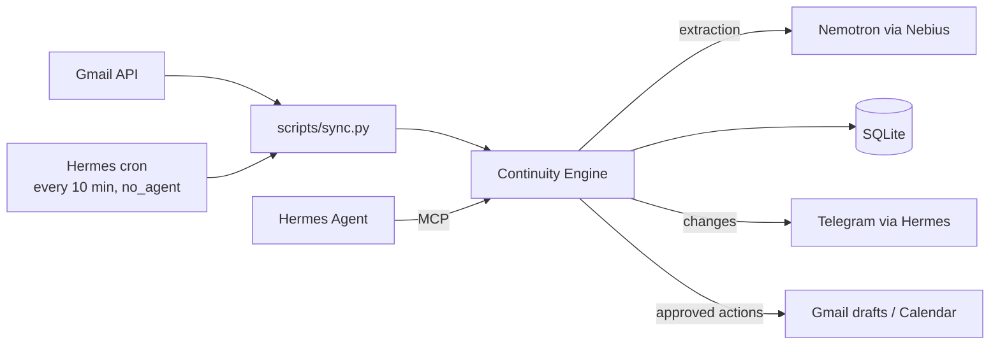

# Continuum — Phase 3 Spec: Connected

**Needs:** every box in Phase 2 §13 checked.

> Phase 2 nudges you. Phase 3 **notices on its own when a loop closes**, and can prepare the next step for your approval.

---

## 1. Success Story (the demo)

1. Open loop: "Wait for Sarah's response" (waiting_on = Sarah, sarah@nvidia.com).
2. Sarah emails: *"Great news, we'd like to interview you on Oct 8 at 10am."*
3. Within ~10 minutes, a Telegram message from Continuum:
   > Sarah replied. ✅ Closed **Wait for Sarah's response**.
   > New: **Prepare for NVIDIA interview**, due Oct 8.
   > Add "NVIDIA interview" to your calendar, Oct 8 10:00? (yes/no)
4. User: *"yes"* → the calendar event is created.
5. Dashboard: the loop shows **Source: email from Sarah** with a link to the thread, plus an **Undo** button on the auto-close.
6. Later: *"Draft a thank-you reply to Sarah"* → a **Gmail draft** is created in the thread. The user reviews and sends it from Gmail.

---

## 2. Principles for this Phase

- **Read little.** Only process emails from people linked to open loops. Never scan the whole inbox.
- **Never send.** Email becomes a Gmail *draft*. Only calendar events are created directly, and only after an explicit yes.
- **Everything is visible and undoable.** Every automatic change is logged and can be reverted.
- **Minimal OAuth scopes.**

---

## 3. Architecture Changes



- **Polling, not webhooks.** A Hermes cron job in script-only mode (`no_agent`) runs `python scripts/sync.py` every 10 min. No LLM cost when nothing's new, and no public URL needed.
- If sync changed anything, the script prints a summary. Hermes delivers stdout to Telegram, and prints nothing when nothing changed. **Check in the docs** that empty output means no message. If not, have the script exit early and document it.
- **Connectors** are thin wrappers in `app/connectors/`. Domain logic stays in the engine.
- Before building, **check whether Hermes or a well-maintained MCP server already offers Gmail/Calendar access.** Only use it if it supports reading by sender and creating drafts. Otherwise build our own. Ingestion into the engine is ours either way.

---

## 4. Scope

**In:** Gmail read (limited to linked people), auto-resolve/update from email, Person linking, Gmail drafts, Calendar event creation with approval, activity log with undo, Connect/Disconnect Google in the UI.

**Out:** sending email, Slack/GitHub/other sources, reading the whole inbox, vector search (in-context lists are enough under ~500 loops), multi-user, cloud hosting.

---

## 5. Data Model Changes

```python
Person:                          # NEW
    id: UUID
    name: str                    # "Sarah"
    email: str | None            # "sarah@nvidia.com"

OpenLoop:
    + person_id: UUID | None     # link to Person (keep waiting_on text for display)

Source:
    kind: "chat" | "email"       # already a column since Phase 1
    + external_id: str | None    # Gmail message id; unique, which makes sync idempotent
    + url: str | None            # link to the Gmail thread
    + sender: str | None

Activity:                        # NEW: what Continuum did, for transparency and undo
    id: UUID
    loop_id: UUID | None
    action: "created" | "updated" | "resolved" | "reopened" | "action_done"
    by: "user" | "chat" | "email"
    detail: str
    undo: JSON | None            # previous field values, or null if not undoable
    created_at: datetime

PendingAction:                   # NEW: anything that touches Google
    id: UUID
    loop_id: UUID | None
    kind: "gmail_draft" | "calendar_event"
    payload: JSON                # validated with Pydantic per kind
    status: "proposed" | "done" | "rejected" | "failed"
    external_id: str | None      # created draft/event id
    created_at, updated_at
```

No migration, same as Phase 2: delete the old `.db` file after pulling, and `create_all` builds the new schema.

**Person linking:**
- Extraction gets the known people list (name, email) and returns `person` for new waiting loops. The engine matches it by case-insensitive name, or creates the Person.
- The email is filled in when the user says it (*"Sarah's email is sarah@nvidia.com"*). A new tool `set_person_email(name, email)` handles that.
- The UI loop detail has an editable "Contact email" field.
- No automatic email guessing.

---

## 6. Email Sync (`scripts/sync.py` → `engine.ingest_email`)

```text
for each Person with an email AND ≥1 open loop:
    fetch Gmail messages from that address newer than last_sync   (query: from:<email> after:<ts>)
    skip if Source.external_id already exists
    text = subject + plain-text body, quotes/signature stripped, cut to 4k chars
    engine.process_message(text, source=Source(kind="email", ...), person=person)
save last_sync (store it in a small `setting` key/value table)
print a summary of changes (or nothing)
```

- The Phase 1 extraction prompt gets one extra context line: *"This is an email from {person}. Open loops involving them: …"*. It's the same schema and the same validation.
- **Auto-resolve only for loops linked to that person.** Drop ids outside that set (extends the Phase 1 hallucination guard).
- Every change writes an `Activity` with `by="email"` and `undo` data.
- Gmail errors or expired tokens: log them, print one clear line ("Google disconnected, reconnect in dashboard"), and write nothing partial.

---

## 7. Approval-Gated Actions

Flow: **propose → user yes → execute → log**.

| MCP tool | Does |
|---|---|
| `propose_calendar_event(loop_id, title, start, end)` | Creates a `PendingAction` and returns its id + summary |
| `propose_gmail_draft(loop_id, to, subject, body, thread_id?)` | Same, for a draft |
| `approve_action(id)` | Executes the action. Hermes may only call it after the user says yes to *that* action |
| `reject_action(id)` | Marks it rejected |
| `set_person_email(name, email)` | Links a contact |

- Hermes can't bypass approval, because Continuum only executes inside `approve_action`. Proposals made by the sync job are delivered to Telegram, and the user's reply goes to Hermes, which approves.
- **Risk is limited by design:** the worst case after a wrong "approve" is an unsent draft or a calendar event the user can delete. Nothing is sent.
- **The dashboard shows pending actions** with Approve/Reject buttons, the same as Telegram.
- Calendar event times use `TIMEZONE`, and end defaults to start + 1h. If the time is ambiguous, Hermes must ask, not guess.

---

## 8. Google Setup

- OAuth "Desktop app" client. The user creates it in Google Cloud Console; the README has step-by-step instructions with screenshots.
- Scopes: `gmail.readonly`, `gmail.compose` (drafts), `calendar.events`. Nothing else.
- Token saved to `data/google_token.json` (gitignored).
- UI: **Connect Google** (opens the local OAuth flow) and **Disconnect**, which deletes the token and revokes it.
- New env: `GOOGLE_CLIENT_SECRET_FILE=./data/client_secret.json`, `SYNC_LOOKBACK_DAYS=7` (for the first sync).

---

## 9. REST API (added)

```http
GET  /api/activity?loop_id=           → timeline
POST /api/activity/{id}/undo          → restore previous values (e.g. reopen)
GET  /api/actions?status=proposed
POST /api/actions/{id}/approve
POST /api/actions/{id}/reject
GET  /api/people   ·  PATCH /api/people/{id}  {email}
GET  /api/google/status  ·  POST /api/google/connect  ·  POST /api/google/disconnect
```

---

## 10. UI Changes

- **Loop detail:** the source shows "✉ Email from Sarah · Oct 1" + **Open in Gmail**, an editable contact email, and an activity timeline with **Undo** on automatic changes.
- **Pending actions** strip at the top (above Needs attention): "Add 'NVIDIA interview' Oct 8 10:00 to calendar? [Approve] [Reject]".
- **Settings** (small gear panel): Google connected ✓ / Connect, and the time of the last sync.
- Auto-resolved loops show a small "closed by email" tag in the resolved view.

---

## 11. Privacy

- Only emails from linked people are fetched. Store only the stripped text used for extraction, not attachments or other messages.
- Logs contain message ids and counts, never subjects or bodies.
- Disconnect removes the token. A **Forget email data** button deletes all `kind="email"` sources. Their loops stay, marked "source deleted".
- README privacy section: list exactly what is read, stored, and sent to Nebius.

---

## 12. Tests (Google APIs mocked)

- **Sync:** only linked senders are queried. The same message twice is processed once. `last_sync` advances. A token error writes nothing and prints a clear line.
- **Reconciliation:** an email resolves only that person's loops. A foreign id gets dropped. Undo restores the loop.
- **Person linking:** name match (case-insensitive), `set_person_email`, and new waiting loops link to the person.
- **Actions:** proposing doesn't call Google. Approve calls it exactly once. Approving twice doesn't create a duplicate. Reject → never executed. Failures → `failed` + logged.
- **Live (optional, `-m live`):** extraction on 3 sample emails (a reply that resolves, an unrelated email, an email that adds a new deadline).

---

## 13. Build Order

1. Tables: Person, Activity, Source columns, PendingAction, setting.
2. Activity logging + undo in the engine (works for chat changes too). Add tests.
3. Person linking in extraction + `set_person_email` + UI field.
4. **Google gate:** OAuth connect, list the last 5 emails from one address, create one draft, create one event, all from a scratch script.
5. `ingest_email` + `sync.py` with mocked tests, then real Gmail.
6. Hermes cron (`no_agent`) → Telegram summary.
7. PendingAction + MCP tools + approval UI.
8. Run the §1 demo end to end. Add a Phase 3 section + Google setup guide to the README.

---

## 14. Done Checklist

- [ ] §1 demo works with a real email and a real calendar
- [ ] Only emails from linked people are read (checked in logs)
- [ ] No email is ever sent; drafts only
- [ ] Every automatic change shows in the activity timeline and can be undone
- [ ] Approve/reject works from Telegram and the dashboard, with no duplicates
- [ ] Disconnect + Forget email data work
- [ ] `pytest` passes offline
- [ ] No tokens or client secrets in git
